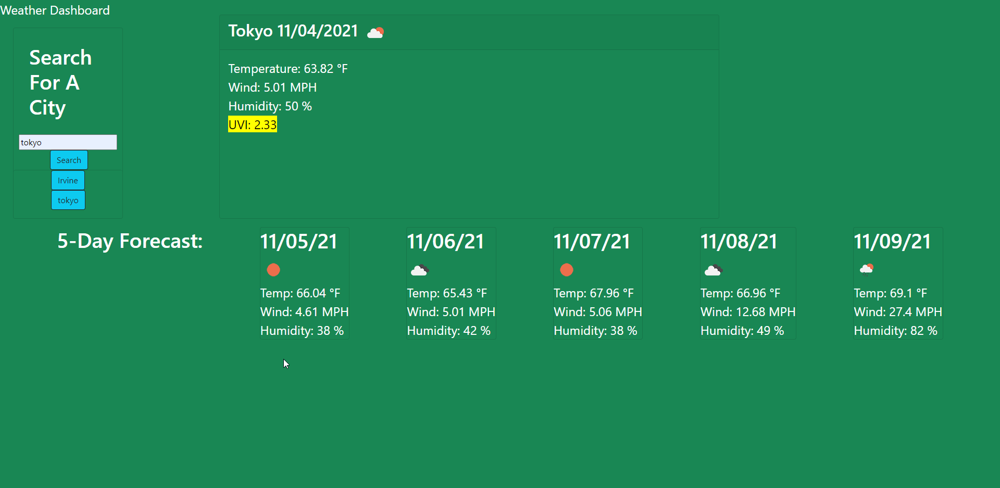

# weather-dashboard
Welcome to my Weather Dashboard application!
In this application I will be using skills I have learned thus far in my coding journey.
When you input a city and then submit it the app will use API to pull data.
The data is then translated and put on to the page to show the weather forecast for right now.
The data will also show you a 5 day forecast.
When you input a city it will be added to a history list and you can click that city again later to load the weather.
If you refresh the page the search data will be saved to your local storage so it will be there when you return.

Thank you for trying my weather dashboard application!

[weather-dashboard deployed](https://veidul.github.io/weather-dashboard/)
